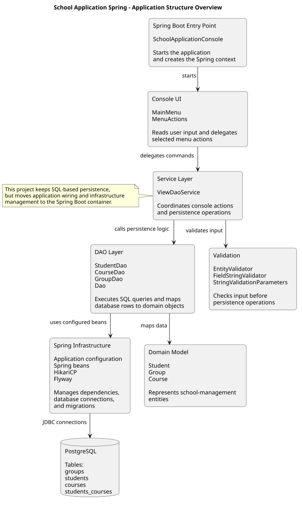
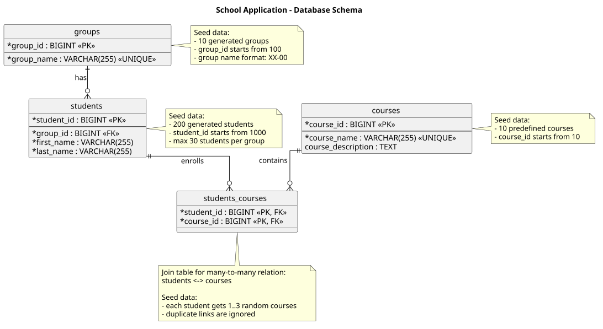

# School Application Spring

### Java 17 · Spring Boot · Spring JDBC · Version 1.0.0

[](https://github.com/Yurii-Kor/school-application-on-spring/actions/workflows/spring-ci.yml)


Console-based school management application built with Spring Boot, Spring JDBC, PostgreSQL, Flyway, HikariCP, Docker, and GitHub Actions.

This project is the second step in the School Application learning series. Unlike the plain JDBC version, it keeps SQL-based persistence but moves application wiring, transaction management, connection handling, and data access exception translation into the Spring ecosystem.

The persistence layer uses Spring JDBC through `NamedParameterJdbcTemplate`, so SQL queries remain explicit while repetitive low-level JDBC boilerplate is reduced. Spring’s data access exception model is also used through `DataAccessException`, making database-related failures easier to handle consistently.

For background on the Spring JDBC approach, see the Baeldung guide: [Spring JDBC and JdbcTemplate](https://www.baeldung.com/spring-jdbc-jdbctemplate).

---
<details>
<summary><h2>Features</h2></summary>

The service and DAO layers support the core school-management operations for groups, students, courses, and student-course enrollments.

The console UI exposes the following user-facing actions:

- Find all groups with a student count less than or equal to a given number.
- List all students enrolled in a course by course name.
- Add a new student.
- Delete a student by student ID.
- Assign a student to a course.
- Remove a student from one of their courses.

</details>

---
<details open>
<summary><h2>Technology Stack</h2></summary>

| Area | Technology |
|---|---|
| Language | Java 17 |
| Build tool | Maven |
| Application framework | Spring Boot |
| Persistence | Spring JDBC, `NamedParameterJdbcTemplate` |
| Database | PostgreSQL |
| Connection pooling | HikariCP |
| Database migrations | Flyway |
| Testing | JUnit 5, Mockito, Spring Test, Testcontainers |
| Containerization | Docker, Docker Compose |
| CI/CD | GitHub Actions, Docker Hub release workflow |

This project keeps SQL queries explicit, but moves application wiring, connection management, transaction boundaries, and database exception handling into the Spring ecosystem.

</details>

---
<details open>
<summary><h2>Application Structure</h2></summary>

This diagram shows the main structural blocks of the Spring Boot JDBC version.  
It highlights how the project moves application wiring and infrastructure management into Spring while keeping SQL-based persistence explicit.



The PlantUML source for this diagram is stored in:

```text
docs/diagrams/application-structure.puml
````

The rendered SVG diagram is stored in:

```text
docs/diagrams/application-structure.svg
```

</details>

---
<details open>
<summary><h2>Database Schema</h2></summary>

The application uses a simple school-management database schema with academic groups, students, courses, and a many-to-many relation between students and courses.



| Table              | Purpose                                  | Seed data                                  |
| ------------------ | ---------------------------------------- | ------------------------------------------ |
| `groups`           | Stores academic groups                   | 10 random groups, IDs start from `100`     |
| `students`         | Stores students assigned to groups       | 200 random students, IDs start from `1000` |
| `courses`          | Stores available courses                 | 10 predefined courses, IDs start from `10` |
| `students_courses` | Join table for student-course enrollment | Each student gets 1–3 random courses       |

The PlantUML source for this diagram is stored in:

```text
docs/diagrams/database-schema.puml
```

The rendered SVG diagram is stored in:

```text
docs/diagrams/database-schema.svg
```

</details>

---

## 🐳 Dockerized Deployment

The application requires PostgreSQL and can be run in two ways:

1. Run the published image from Docker Hub without cloning the repository.
2. Build the application locally from the source code.

<details>
<summary><strong>Option 1: Run from Docker Hub</strong></summary>

This option is intended for quickly trying the released application. The source repository is not required.

The commands below are intended for Bash or WSL.

### 1. Pull the released application image

```bash
IMAGE=yuriikorolkov/school-application-on-spring:1.0.0

docker pull "$IMAGE"
````

The immutable version tag `1.0.0` is recommended for reproducible runs. The `latest` tag points to the most recently published release.

### 2. Create a Docker network

```bash
docker network create school-app-demo
```

### 3. Start PostgreSQL

```bash
docker run -d --rm \
  --name school-app-postgres \
  --network school-app-demo \
  -e POSTGRES_DB=school_console_app \
  -e POSTGRES_USER=school_demo \
  -e POSTGRES_PASSWORD=local-demo-password \
  --health-cmd="pg_isready -U school_demo -d school_console_app" \
  --health-interval=5s \
  --health-timeout=5s \
  --health-retries=10 \
  postgres:16
```

### 4. Wait until PostgreSQL is ready

```bash
until docker inspect \
  -f '{{.State.Health.Status}}' \
  school-app-postgres \
  | grep -q '^healthy$'; do
  echo "Waiting for PostgreSQL..."
  sleep 2
done
```

### 5. Run the application

```bash
docker run --rm -it \
  --name school-app \
  --network school-app-demo \
  -e SPRING_DATASOURCE_URL=jdbc:postgresql://school-app-postgres:5432/school_console_app \
  -e SPRING_DATASOURCE_USERNAME=school_demo \
  -e SPRING_DATASOURCE_PASSWORD=local-demo-password \
  "$IMAGE"
```

The application starts in interactive console mode. Select `q` to exit.

### 6. Clean up the demo environment

```bash
docker stop school-app-postgres
docker network rm school-app-demo
```

The PostgreSQL container uses temporary storage in this demo, so its data is removed during cleanup.

</details>

---

<details>
<summary><strong>Option 2: Build and run locally</strong></summary>

This option is intended for development and testing changes made to the source code.

The local startup scripts automatically:

* build the executable Spring Boot JAR;
* optionally run Maven tests;
* validate the Docker Compose configuration;
* build the application Docker image;
* start PostgreSQL;
* run the application in interactive console mode.

Maven tests are skipped by default to make repeated local startup faster.

<details>
<summary><strong>Linux or WSL</strong></summary>

Make the script executable after cloning the repository:

```bash
chmod +x run.sh
```

### Standard startup

Build the application without running tests and start the local Docker environment:

```bash
./run.sh
```

### Startup with Maven tests

Run the complete Maven test suite before starting the application:

```bash
./run.sh --run-tests
```

### Startup with a clean database

Remove the existing PostgreSQL container and volume before startup:

```bash
./run.sh --reset-database
```

### Startup with a custom PostgreSQL password

```bash
./run.sh --postgres-password "my-local-password"
```

### Run tests and reset the database

```bash
./run.sh \
  --run-tests \
  --reset-database
```

### Reset the database and use a custom password

```bash
./run.sh \
  --reset-database \
  --postgres-password "my-local-password"
```

### Use all available startup options

```bash
./run.sh \
  --run-tests \
  --reset-database \
  --postgres-password "my-local-password"
```

### Display the available options

```bash
./run.sh --help
```

</details>

<details>
<summary><strong>Windows PowerShell</strong></summary>

PowerShell may prevent local scripts from running because of the current execution policy. The script can be started for the current invocation without permanently changing the system policy:

```powershell
powershell -ExecutionPolicy Bypass -File .\run.ps1
```

If local scripts are already allowed, use the shorter commands below.

### Standard startup

Build the application without running tests and start the local Docker environment:

```powershell
.\run.ps1
```

### Startup with Maven tests

Run the complete Maven test suite before starting the application:

```powershell
.\run.ps1 -RunTests
```

### Startup with a clean database

Remove the existing PostgreSQL container and volume before startup:

```powershell
.\run.ps1 -ResetDatabase
```

### Startup with a custom PostgreSQL password

```powershell
.\run.ps1 -PostgresPassword "my-local-password"
```

### Run tests and reset the database

```powershell
.\run.ps1 `
  -RunTests `
  -ResetDatabase
```

### Reset the database and use a custom password

```powershell
.\run.ps1 `
  -ResetDatabase `
  -PostgresPassword "my-local-password"
```

### Use all available startup options

```powershell
.\run.ps1 `
  -RunTests `
  -ResetDatabase `
  -PostgresPassword "my-local-password"
```

The PowerShell options can also be provided on one line:

```powershell
.\run.ps1 -RunTests -ResetDatabase -PostgresPassword "my-local-password"
```

</details>

</details>

---

<details>
<summary><strong>Local environment management</strong></summary>

After the console application exits, PostgreSQL remains available and its data is preserved for the next startup.

### Stop the local environment

```bash
docker compose down
```

This stops and removes the containers and network while preserving the PostgreSQL volume.

### Stop the environment and delete the database

```bash
docker compose down --volumes
```

This also removes the PostgreSQL volume and all locally stored application data.

The same cleanup can be performed automatically during the next startup.

Linux or WSL:

```bash
./run.sh --reset-database
```

Windows PowerShell:

```powershell
.\run.ps1 -ResetDatabase
```

</details>

---

<details>
<summary><strong>Build and Test without Docker</strong></summary>

This section is intended for local development when PostgreSQL is already available and configured for the application.

Run the test suite:

```bash
./mvnw clean test
````

Build the executable Spring Boot JAR:

```bash
./mvnw clean package
```

Run the packaged application:

```bash
java -jar target/SchoolApplicationSpring-1.0.0.jar
```

The application still requires PostgreSQL to be available according to the configured datasource properties. For a fully prepared local environment, prefer the Docker-based startup scripts described above.

</details>

---

## Project Scope

This project is part of a learning series that implements the same school-management domain through progressively higher persistence abstractions:

1. [School Application JDBC](https://github.com/Yurii-Kor/school-application-jdbc) — plain JDBC, SQL, DAO pattern, manual wiring.
2. [School Application on Spring](https://github.com/Yurii-Kor/school-application-on-spring) — Spring Boot with Spring JDBC infrastructure.
3. [School Application Hibernate](https://github.com/Yurii-Kor/school-application-hibernate) — Hibernate / JPA persistence layer.
4. [School Application Spring Data JPA](https://github.com/Yurii-Kor/school-application-spring-data-jpa) — Spring Data JPA repositories.

The goal of the series is to show how the data access layer evolves from manual SQL and JDBC code to repository-based persistence.

This repository represents the second step of the series. It keeps SQL queries explicit, but replaces manual application wiring and low-level JDBC infrastructure with Spring Boot features.

It demonstrates:

* Spring Boot application configuration for a console application.
* Spring JDBC persistence with `NamedParameterJdbcTemplate`.
* DAO classes that keep SQL queries visible and explicit.
* Spring-managed dependency injection instead of manual object wiring.
* Transaction management through Spring annotations.
* Spring data access exception handling through the `DataAccessException` model.
* PostgreSQL schema management through Flyway migrations.
* Connection pooling through HikariCP.
* Integration testing with Spring Test and Testcontainers.
* Dockerized runtime setup and GitHub Actions CI/CD.
